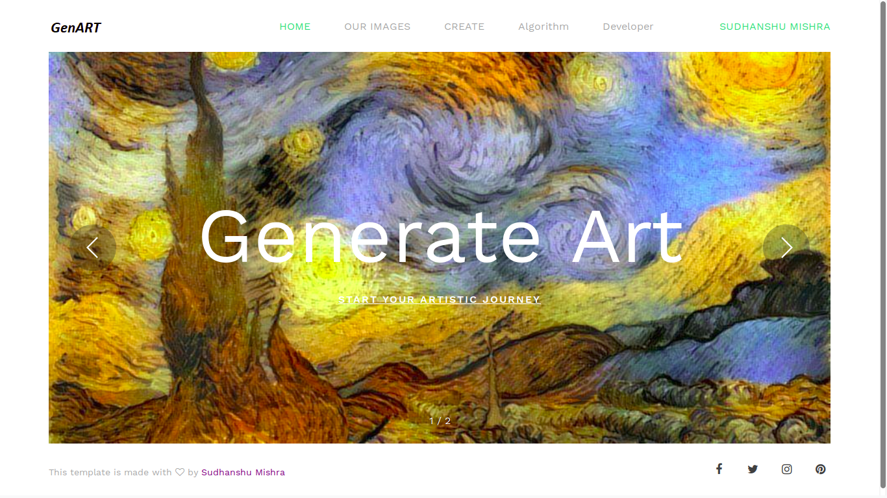
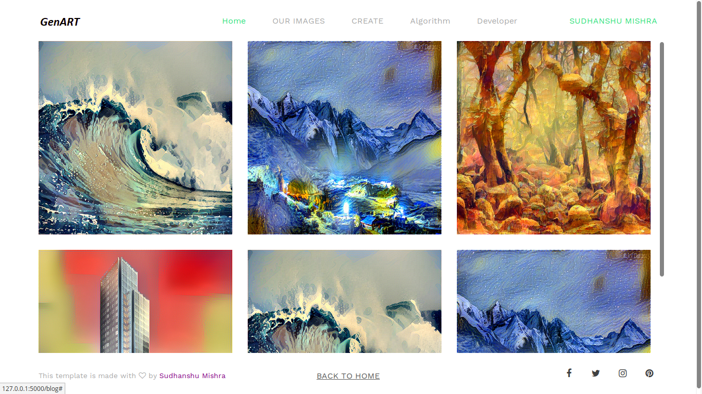
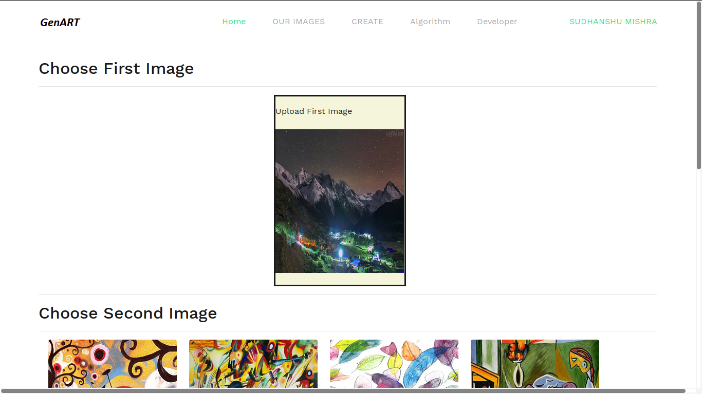
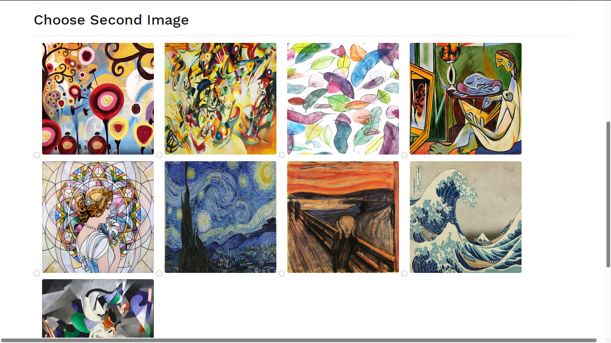
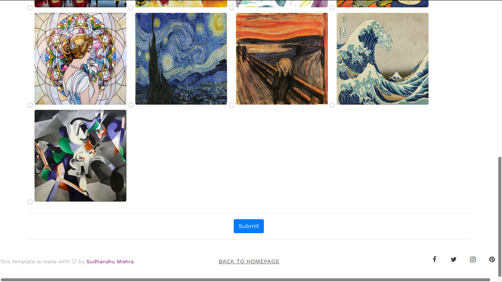
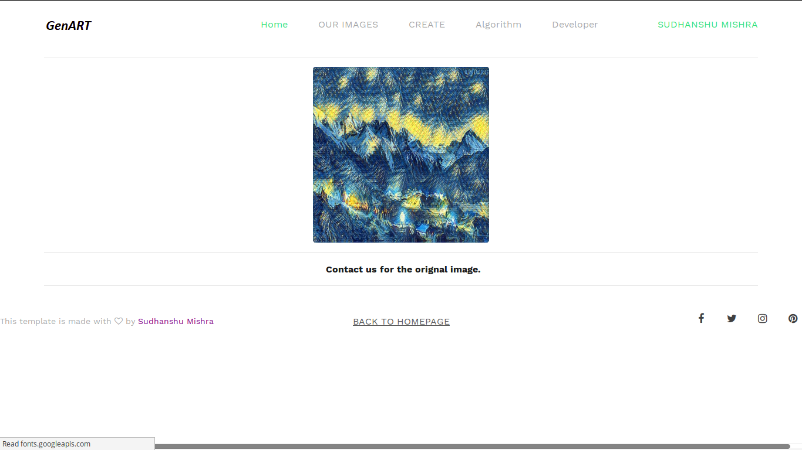

# Genart

### Motivation
>Humans have the ability to create great art through a complex interplay between content and style of an image.
However, there is many non tested algorithmic way of doing it. Here we want to explore and compare various interesting
algorithmic way of doing so. We hope that our work could help understand how humans create and perceive artistic
imagery in an algorithmic way and later on build an application around it.

### What it is ??
>Application for Performing “Style Transfer on Images” which is developed utilizing the comparative study of
different algorithms and and the application is available and compatible with all the platforms, since it is a Web App.

### Applicability 
>The developed application can be used as a tool for generating artworks resembling to the styles of famous artists,
whereas the study will help in how the human brain interprets artistic imagery.
Customizing it to be a third party api can provide a service for various camer based application for applying filters

### Algorithm
>In 2016, Johnson et al. published [Perceptual Losses for Real-Time Style Transfer and Super- Resolution](https://cs.stanford.edu/people/jcjohns/eccv16/),
which frames neural style transfer as a super-resolution-like problem using perceptual loss. 

### Presentation
> Yes! I actually made a presentation on it :sweat_smile:, [Click here ](https://pdfhost.io/v/bC3~5H77f_Style_Transfer_on_Images4pdf.pdf)

### Live Demo
> Not Live yet  :disappointed:, I will update this space shortly.

### Sneak Peak

